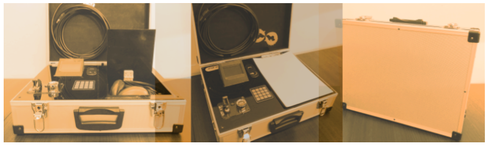

Prototipo de intercomunicador táctico para situación de tomas de rehenes, con el objetivo de sustituir el actual equipamiento utilizado por las fuerzas especiales en situaciones de negociación con captores. El proyecto ganó la convocatoria *Universidad, Diseño y Desarrollo Productivo*, consiguiendo así una beca para fabricar el prototipo.

La propuesta tiene como premisa contemplar soluciones open-source a nivel de hardware y software, con el objetivo de presentar un sistema viable económicamente. Se integraron y diseñaron distintos elementos a fin de desarrollar una interfaz de usuario integrada con el sistema de comunicación.

## Información técnica
El dispositivo cuenta con las siguientes funcionalidades:
* Establece una comunicación telefónica entre dos sujetos: negociador y captor.
* Incluye batería para autonomía.
* Interfaz de usuario con navegación por diferentes menúes.
* Funcionalidades de grabación, guardado de audio y reproducción de archivos.

Para el desarrollo se utilizaron plataformas de hardware como **Arduino** y **Raspberry Pi**. Se requirió comunicar ambos equipos entre sí mediante protocolos de **comunicación serie**, y también con los **periféricos** de control de usuario. A nivel de software se trabajó con **Linux embebido** y lenguajes como **Python**, **C/C++** y **Bash**.
